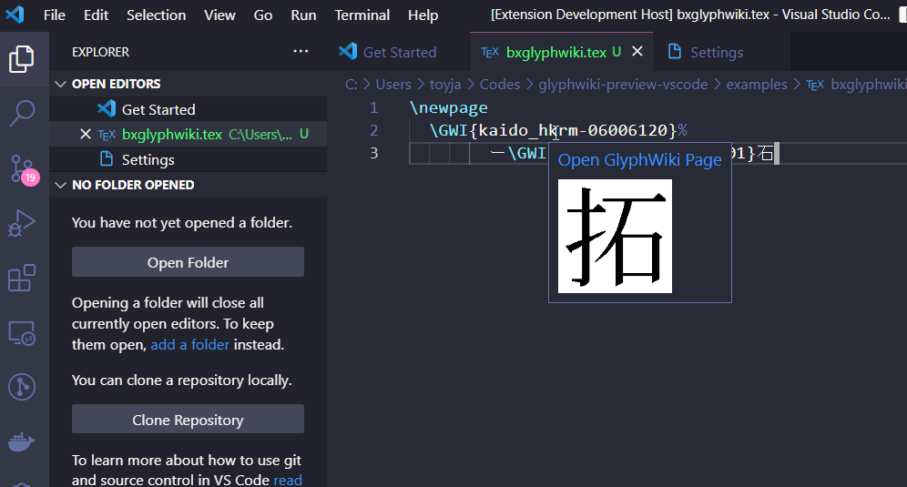

# glyphwiki-preview-vscode README

`\GWI{u4e00}`のような要素の上に画像を表示するプラグインです。

## Screenshot



## Features

TBD

## Extension Settings

画像の最大幅を設定できます。

```json
"glyphwiki-preview.imagePreviewMaxWidth": 100
```

## Release Notes

### 0.0.1

Initial release of `GlyphWiki Preview`

## Reference Links

- [https://hdic.jp/](https://hdic.jp/)
- [https://github.com/zr-tex8r/BXglyphwiki](https://github.com/zr-tex8r/BXglyphwiki)

## License

MIT
